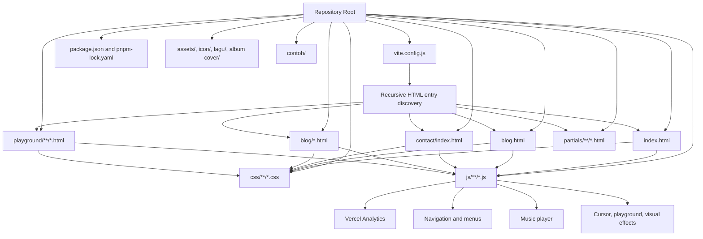
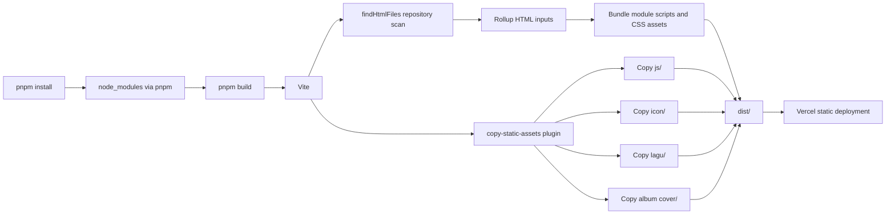
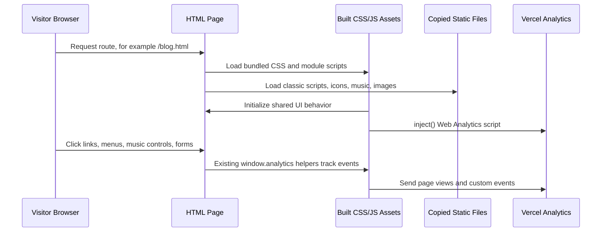

# Akmal Alif Portfolio

Static personal portfolio website built with Vite, plain HTML, CSS, and JavaScript.

This repository is not a framework app. There is no React, Vue, Svelte, routing framework, or backend runtime. Vite is used as the development server and production build tool for a multi-page static site.

## Architecture

### Codebase Map



The site is organized as static HTML pages plus shared CSS, shared browser JavaScript, and static media. `vite.config.js` is the central build configuration and automatically treats visible `.html` files as build entries.

### Runtime Model

- The app is a static multi-page website.
- Pages are regular `.html` files served by Vite during development and emitted into `dist/` during production builds.
- Styling is loaded from plain CSS files referenced by each page.
- Interactivity is handled by plain JavaScript files under `js/` and page-local scripts.
- Some scripts are referenced as classic browser scripts instead of bundled ES modules, so Vite may warn that those scripts cannot be bundled without `type="module"`. The build still succeeds.

### Vite Entry Discovery

`vite.config.js` recursively scans the repository for `.html` files and passes them to Rollup as build inputs.

The scanner skips:

- `node_modules/`
- `dist/`
- Hidden directories such as `.kilo/` and `.git/`

Because entries are discovered dynamically, adding a new visible `.html` file anywhere in the repo makes it part of the Vite build unless it is inside a skipped directory.

### Build Pipeline



Vite bundles module-based entries, emits processed HTML into `dist/`, and then the custom plugin copies static folders that are loaded directly by browser paths or dynamic runtime code.

### Browser Runtime Flow



Each page is independently loadable. Shared scripts provide common behavior, while `js/analytics.js` initializes the official Vercel Analytics browser package and preserves the existing `window.analytics` helper API used across the codebase.

### Main Areas

- `index.html` is the main portfolio landing page.
- `blog.html` is the blog listing page.
- `blog/` contains individual blog article pages.
- `contact/` contains the contact page and contact-specific scripts/styles.
- `playground/` contains experimental interactive pages.
- `partials/` contains reusable HTML fragments used by the site.
- `js/` contains shared browser scripts for analytics, navigation, custom cursor, music player behavior, menus, and other interactions.
- `icon/`, `lagu/`, and `album cover/` contain static assets copied directly into the build output.
- `contoh/` contains example or reference content. The nested `contoh/scramble effect/package.json` is not part of the root app workspace.

### Static Asset Copying

The custom `copy-static-assets` plugin in `vite.config.js` copies these directories into `dist/` after production builds:

- `js/`
- `icon/`
- `lagu/`
- `album cover/`

This preserves files that are loaded directly by browser paths or dynamic runtime code instead of being bundled by Vite.

## Package Manager

This repo uses pnpm.

The expected package manager is declared in `package.json`:

```json
"packageManager": "pnpm@11.2.2"
```

Dependencies are locked in `pnpm-lock.yaml`. The root npm lockfile has been removed.

`pnpm-workspace.yaml` is present only for pnpm build-script approval:

```yaml
allowBuilds:
  esbuild: true
```

It does not define workspace packages, so nested example packages are not enrolled as part of a pnpm workspace.

## Requirements

- Node.js compatible with Vite 5.
- pnpm 11.2.2 or compatible.

If pnpm is not available, enable it with Corepack:

```powershell
corepack enable
corepack prepare pnpm@11.2.2 --activate
```

## Install

Install root dependencies from the repository root:

```powershell
pnpm install
```

## Development

Start the Vite development server:

```powershell
pnpm dev
```

The dev server is configured to:

- Run on port `3000`.
- Open the browser automatically.
- Use polling for better Windows/XAMPP filesystem compatibility.

Default local URL:

```text
http://localhost:3000/
```

## Production Build

Build the static site:

```powershell
pnpm build
```

The output is written to:

```text
dist/
```

During build, Vite processes all discovered HTML entry points and the custom plugin copies static asset directories into `dist/`.

## Vercel Deployment

This site is deployed as a static Vite project on Vercel.

Use these Vercel project settings:

```text
Framework Preset: Vite
Root Directory: ./
Install Command: pnpm install
Build Command: pnpm build
Output Directory: dist
```

The repository is public so Vercel Hobby deployments can be triggered from Git commits without private-repository collaboration restrictions. When the repository was private, Vercel blocked deployments from commits authored by accounts that were not members of the Vercel team. Making the repository public avoids that commit-author access block for normal Git-based deployments.

If a deployment is blocked with a message about the commit author not having access, check these items:

- The GitHub repository connected to Vercel is public, or the commit author is a member of the Vercel project/team.
- The Vercel project is connected to the intended GitHub repository and branch.
- The latest commit exists on the branch Vercel is deploying, usually `main`.
- The commit author email is connected to the expected GitHub/Vercel account if the repo is private.

Vercel Analytics is initialized from `js/analytics.js` with the official `@vercel/analytics` browser package. Vercel Speed Insights is initialized from `js/speed-insights.js` with the official `@vercel/speed-insights` browser package. After deployment, visit the live site and navigate between pages to generate page views and real-user performance metrics in the Vercel dashboards.

## Preview Build

Preview the production build locally:

```powershell
pnpm preview
```

Run `pnpm build` before previewing so `dist/` exists and reflects the latest source.

## Common Workflow

```powershell
pnpm install
pnpm dev
pnpm build
pnpm preview
```

## Notes For Contributors

- Keep new root dependencies in `package.json` and update `pnpm-lock.yaml` with `pnpm install`.
- Do not add `package-lock.json`; this project uses pnpm.
- Do not add workspace package globs unless intentionally converting the repo into a workspace.
- Place hidden planning or agent files under hidden directories such as `.kilo/` so Vite entry discovery ignores them.
- Be careful when adding new `.html` files in visible directories because they automatically become Vite build entries.
